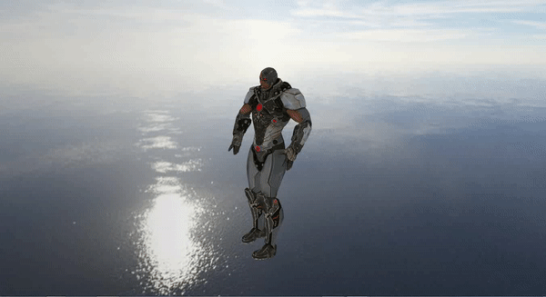

# 3Dev
3Dev is a simple 3D engine. It uses OpenGL, SFML, Assimp.

## Features:

Loading textures

Loading models

Loading simple animations

Simple lighting

Simple camera

Drawing simple meshes

Loading shaders

## Animation

