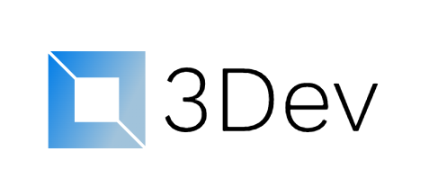
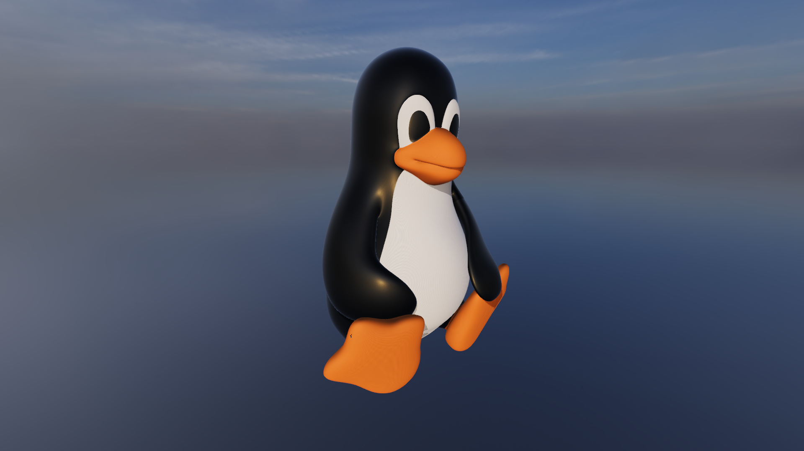
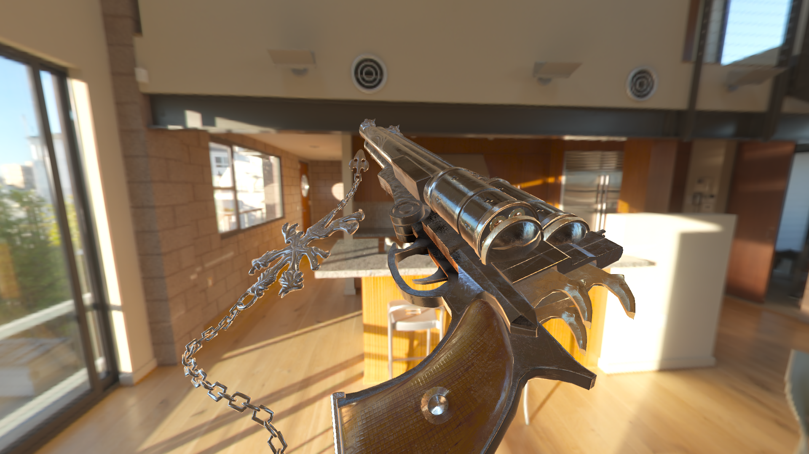
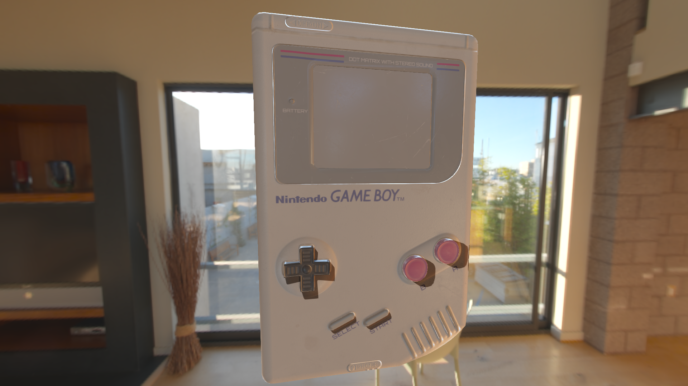

# 3Dev


  

## About
- 3Dev is a simple and lightweight game engine, which uses SFML, OpenGL, ReactPhysics3D and Assimp
## Features
- Rigid body physics
- Loading a lot of model formats (.obj, .dae, .fbx and much more...)
- Skeletal animation
- Post processing support
- HDR, tone mapping and gamma-correction
- FXAA
- Physically Based Rendering
- Image Based Lighting
- Shadow mapping
- Diffuse, normal, metalness, emission, roughness, ambient occlusion and opacity maps
- Audio
## TODO
TODO list is now in the [projects](https://github.com/1Kuso4ek1/3Dev/projects/1)!
## Building
### Dependencies
1. GLEW
2. SFML
3. ReactPhysics3D
4. Assimp
5. LightLog
6. jsoncpp
7. Angelscript
### Let's build it
First of all, you need to clone this repository
```
git clone --recursive https://github.com/1Kuso4ek1/3Dev.git
cd 3Dev/3Dev
```
When it's done, we can create a "build" directory and call cmake
```
mkdir build && cd build
cmake ..
```
This process won't take much time...  
Makefile is finally generated!
```
make -j4
sudo make install # So you can use the library everywhere...
```
You can use 3Dev in your cmake project pretty easily
```
find_package(3Dev REQUIRED)
target_link_libraries(cool-project PUBLIC 3Dev ${3DEV_DEPS} *another stuff*)
...
target_include_directories(
	cool-project
	PUBLIC
	${3DEV_INCLUDE_DIR}
)
```
## Projects
### Bloodbath
A small online FPS game, it can be downloaded from [itch.io](https://1kuso4ek1.itch.io/bloodbath)!

## Screenshots



