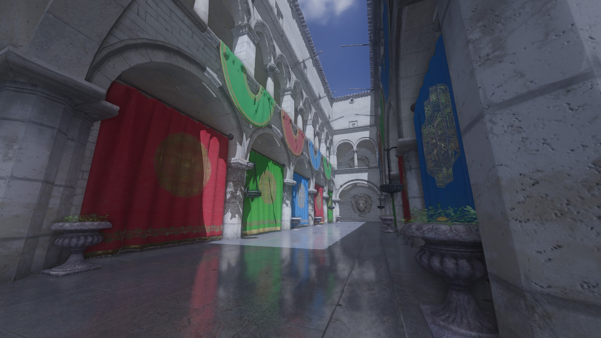
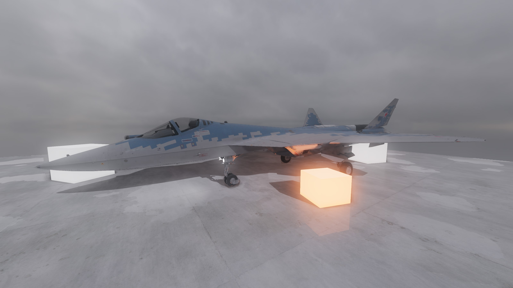
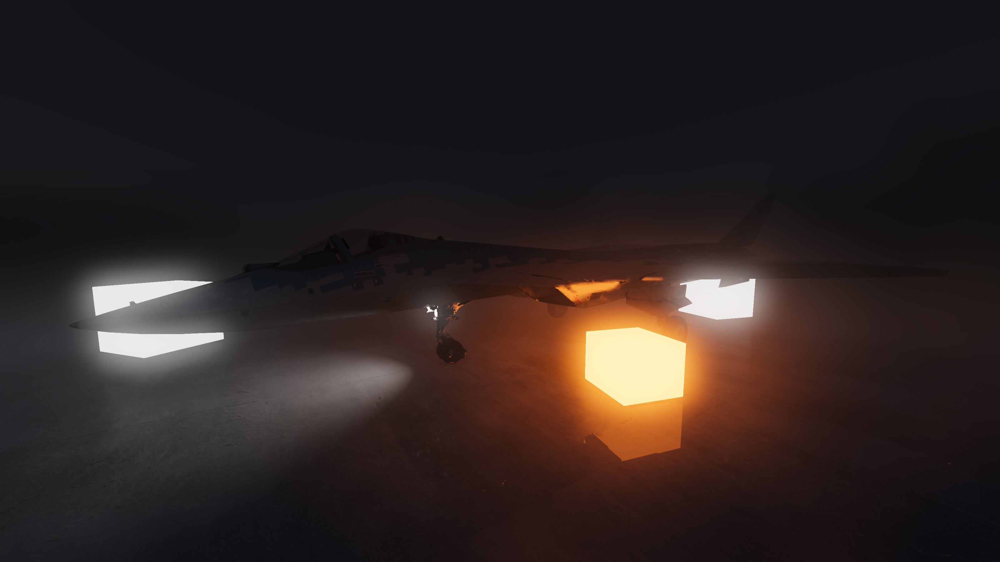
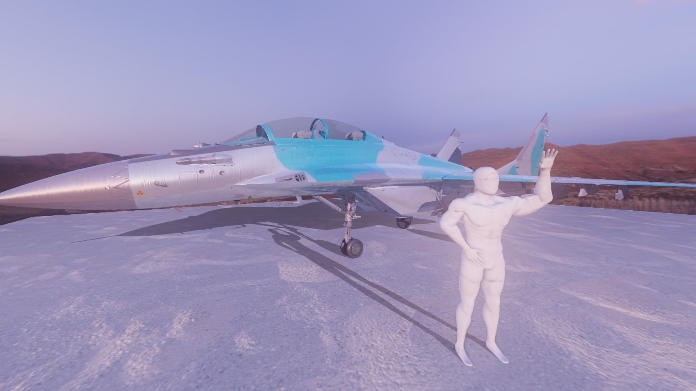
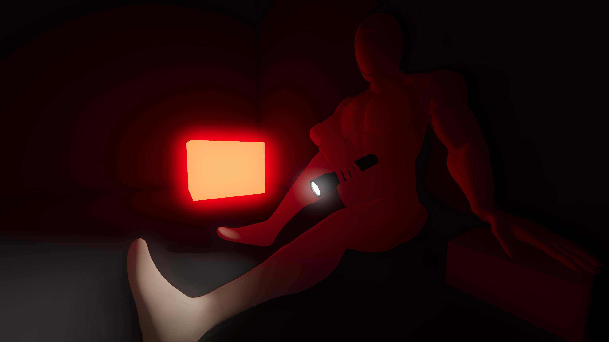

# 3Dev

  

## About
- 3Dev is a lightweight, crossplatform and easy-to-use game engine with some useful instruments, besides the library itself.
## Features
- Physically Based Rendering
- Deferred + Forward (for transparency) rendering
- Rigid body physics
- A lot of supported model formats (.obj, .dae, .fbx and much more...)
- Good animation system
- Skeletal animations support
- HDR
- Post-processing: ACES tonemapping, FXAA, Physically based bloom, SSAO, Deferred decals
- Shadow mapping
- Diffuse, normal, metalness, emission, roughness, ambient occlusion and opacity maps
- 3D audio
- User interface with TGUI
- Separate console program for scene or animation rendering
- Scripting with Angelscript
- 3Dev Editor
- Node-based hierarchy
- Built-in code editor
## TODO
TODO list is in the [projects](https://github.com/1Kuso4ek1/3Dev/projects/1)!
## Building
All building instructions are [here](https://1kuso4ek1.github.io/3Dev/build.html)!
## Tutorial
[English](https://1kuso4ek1.github.io/3Dev/) and [Russian](https://telegra.ph/Razrabotka-igr-s-pomoshchyu-3Dev-01-06)!
## Screenshots

