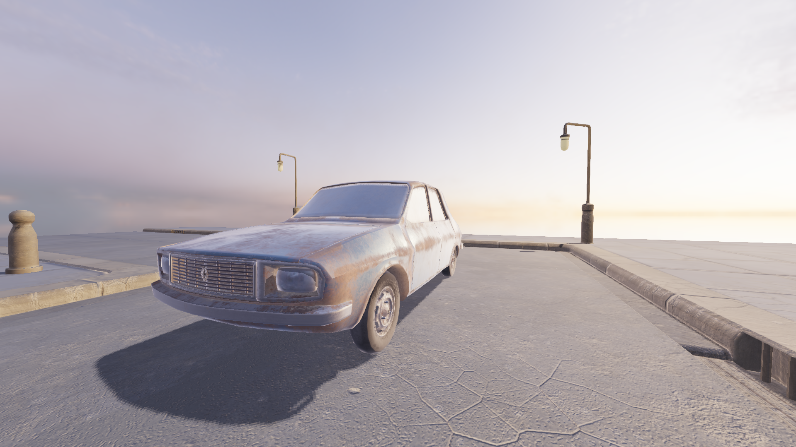
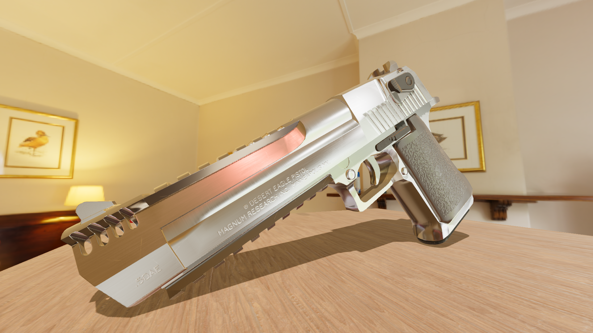

# 3Dev

  

## About
- 3Dev is a simple and lightweight game engine, which uses SFML, OpenGL, ReactPhysics3D and Assimp
## Features
- Rigid body physics
- Loading a lot of model formats (.obj, .dae, .fbx and much more...)
- Skeletal animation
- Post processing support
- HDR, tone mapping and gamma-correction
- FXAA
- Physically Based Rendering
- Image Based Lighting
- Shadow mapping
- Diffuse, normal, metalness, emission, roughness, ambient occlusion and opacity maps
- Audio
- Scripting with Angelscript
- 3Dev Editor
## TODO
TODO list is now in the [projects](https://github.com/1Kuso4ek1/3Dev/projects/1)!
## Building
All building instructions are [here](https://1kuso4ek1.github.io/3Dev/build.html)!
## Projects
### Bloodbath
A small online FPS game, it can be downloaded from [itch.io](https://1kuso4ek1.itch.io/bloodbath)!

## Screenshots

